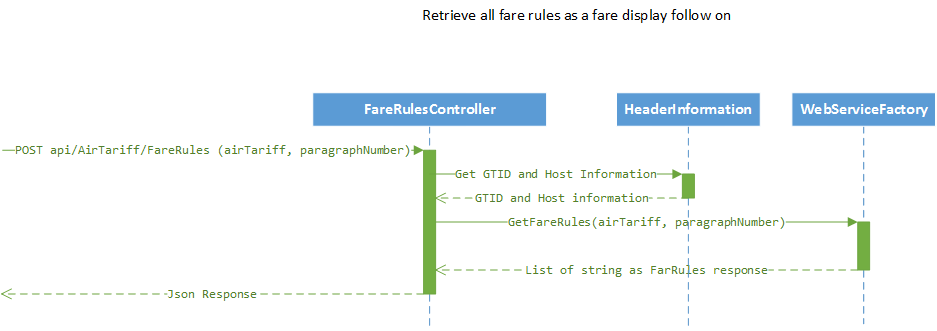
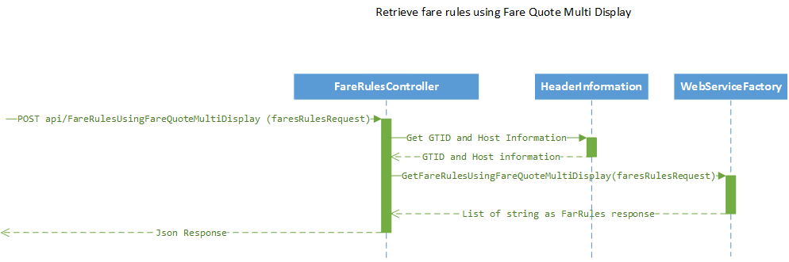
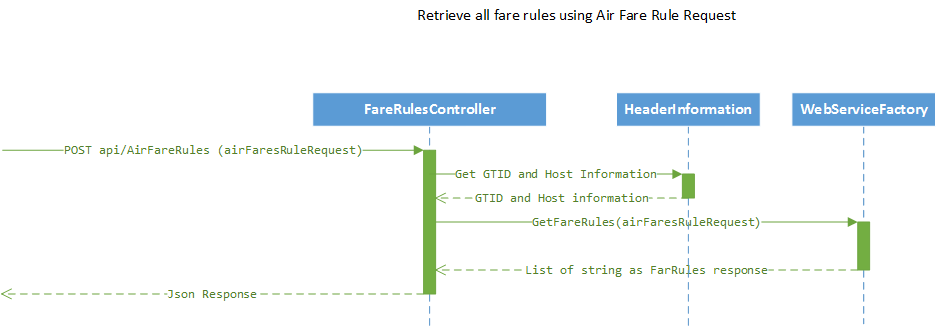
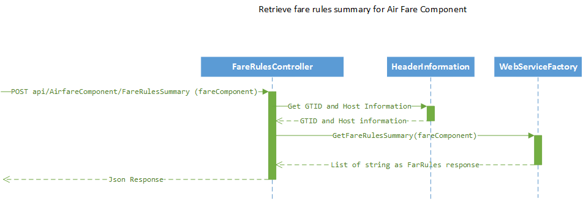
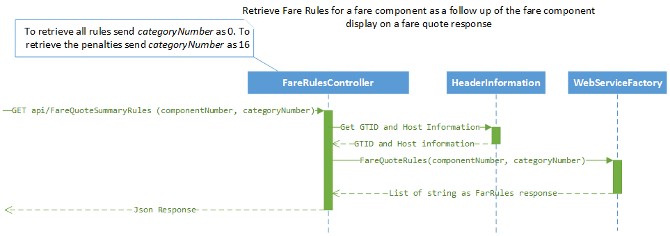
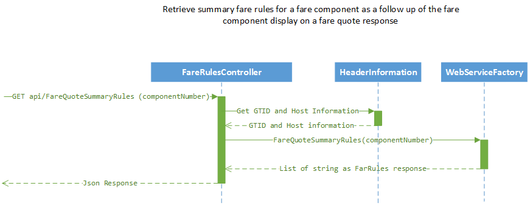

# Channel Service for *Fare Rules*

## Introduction 
This is the Channel Service for retrieving  *Fare Rules* from the different scenarios of Fare Quote, Fare Display,  Filed Fare Display etc.

## Endpoints
This channel service is available at the following endpoints:

 - Development Environment: https://cs-fare-rules.smartpoint-dev1.tvlport.com
    - /AirfareComponent/FareRules: POST to retrieve the fare rules for *AirfareComponent*
    - /AirTariff/FareRules: POST to retrieve the fare rules for *AirTariff* and a paragraph number
    - /AirTariffAndFareSearch/FareRules: POST to retrieve the fare rules for *AirTariff*  and *AirfareSearch*
    - /FareRules: POST to retrieve the fare rules using *FareRulesRequest*
    - /FareRulesUsingFareQuoteMultiDisplay: POST to retrieve the fare rules using *FareQuoteMultiDisplay*
    - /FareRulesSummary: POST to retrieve the fare rules summary using *FareRulesRequest*
    - /AirFareRules: POST to retrieve the *Air Fare Rules* using *AirFareRulesRequest*
    - /AirfareComponent/FareRulesSummary: POST to retrieve the fare rules summary for *AirfareComponent*
    - /FareQuoteRules: GET to retrieve the fare rules using a component number and category number
    - /FareQuoteSummaryRules: GET to retrieve the fare summary rules using a component number
 - Swagger UI: https://cs-fare-rules.smartpoint-dev1.tvlport.com/swagger/
 - Swagger Document: https://cs-fare-rules.smartpoint-dev1.tvlport.com/swagger/v1/swagger.json

## GDS Supported
This channel service supports the following host systems:

 - 1G - Galileo
 - 1V - Apollo
 - 1P - Worldspan
 - 1J - Axess

## Technologies
List of technologies used in this service are:

 - .Net Core
 - ASP.Net Core
 - XUnit
 - NuGet

## Design Documents

- [Fare Rules Channel Service Design](https://teamsites.travelport.com/techdvlp/evolve/Engineering%20Document%20Library/Evolve%20Features%20Achitecture/Fare%20Rules/Fare%20Rules%20Channel%20Service%20Design.docx)
- [FareRules diagrams](https://teamsites.travelport.com/techdvlp/evolve/Engineering%20Document%20Library/Evolve%20Features%20Achitecture/Fare%20Rules/FareRules%20diagrams.vsdx)
- [Sequence Diagram for Fare Rules Channel Service](https://teamsites.travelport.com/techdvlp/evolve/Engineering%20Document%20Library/Evolve%20Features%20Achitecture/Fare%20Rules/Sequence%20Diagram%20for%20Fare%20Rules%20Channel%20Service.vsdx)

## Request Structure
### Request for retrieving fare rules for Air Tariff with paragraph number
```json
{
    "LineNumber": 23
}
```

### Request for retrieving fare rules for Air Tariff and Air Fare Search
```json
{
	"AirTariff": {
		"LineNumber": 1
	},
	"AirfareSearch" : {
		"Origin": {
	    	"Code": "DEN"
		},
		"Destination": {
	    	"Code": "ATL"
		},
		"OutboundDate": "2018-04-30"
	}
}
```

### Request for retrieving fare rules for Fare Component number
GET https://cs-fare-rules.smartpoint-dev1.tvlport.com/api/farequoterules/?componentNumber=1&categoryNumber=16

### Request for retrieving fare rules summary for Fare Component number
GET https://cs-fare-rules.smartpoint-dev1.tvlport.com/api/farequotesummaryrules/?componentNumber=1

## Response Structure

### Summary Response

```json
[
    "WHO:",
    "DAY:",
    "SEA:",
    "FLT:",
    "ADV:CONDITIONS APPLY",
    "MIN:",
    "MAX:",
    "STP:",
    "TRF:CONDITIONS APPLY",
    "CMB:SOJ/DOJ/CT2/CT2/EOE",
    "B/O:TO ATL 30JAN-2FEB19.FROM ATL 4-6FEB19",
    "SUR:CONDITIONS APPLY |",
    "ACC:",
    "TVL:",
    "TKT:CONDITIONS APPLY",
    "CHG:CXL BEF DEP FREE/CXL AFT DEP FREE/CHG BEF DEP FREE/CHG",
    "AFT DEP FREE",
    "CHD:ACC CHD 2-11 100PCT.INF W/O SEAT UNDER 2 FREE",
    "DSC:"
]
```

### Rules Response

```json
[
    "16. PENALTIES",
    "FOR ONE WAY -FEY TYPE FARES   NOTE - RULE REFX IN DGR",
    "APPLIES",
    "UNLESS OTHERWISE SPECIFIED",
    "  CANCELLATIONS",
    "    BEFORE DEPARTURE",
    "      CANCELLATIONS PERMITTED.",
    "         NOTE -",
    "          --",
    "          EXCHANGE - CHANGE TO 1ST TICKETED FLIGHT COUPON",
    "                     OR  WHOLLY UNUSED TICKET",
    "          --",
    "            RESIDUAL VALUE MAY BE REFUNDED OR APPLIED",
    "            TOWARD   MOST  DOMESTIC OR INTERNATIONAL",
    "            NEW TICKET PURCHASE AT CURRENT FARE LEVELS.",
    "            ANY DIFFERENCE IN FARE / TAX",
    "            COLLECTED/REFUNDED AT TIME OF TICKET EXCHANGE.",
    "          --",
    "            TICKETS MUST BE REISSUED WHEN ANY VOLUNTARY",
    "            CHANGE IS  MADE.",
    "          .",
    "          1. WHOLLY UNUSED TICKETS -",
    "             CHANGE TO ORIGINATING FLIGHT -",
    "          --",
    "             REPRICE USING CURRENT QUALIFYING",
    "                FARES IN EFFECT TODAY",
    "          --",
    "          NO CHARGE OR HIGHEST FEE OF ONLY CHANGED",
    "          FARE COMPONENTS. ONLY CHARGE ONE FEE FOR ONLY",
    "          CHANGED FARE COMPONENTS IF CHANGED FARE COMPONENTS",
    "          HAVE A FEE TO CHARGE.",
    "          --",
    "          1. ANY CARRIER FARE TYPE EXCEPT EOU/ERU ARE USED",
    "          2. ADV RES IS MEASURED FROM REISSUE DATE TO",
    "          DEPARTURE OF PRICING UNIT",
    "          --",
    "            WHEN CHANGE RESULTS IN FARE DIFFERENCE --",
    "          --",
    "          REFUND RESIDUAL VIA ORIGINAL FORM OF PAYMENT //",
    "          ADD-COLLECT FARE DIFFERENCE IF ANY // CHARGE",
    "          CHANGE FEE WHEN APPLICABLE",
    "          --",
    "    AFTER DEPARTURE",
    "      CANCELLATIONS PERMITTED.",
    "         NOTE -",
    "          --",
    "            CALCULATE DIFFERENCE BETWEEN FARE PAID AND",
    "            QUALIFYING FARE FOR TRAVEL COMPLETE",
    "            USING FARES OF ORIGINAL TICKET DATE /",
    "            REFUND RESIDUAL VALUE IF ANY TO ORIGINAL",
    "            FORM OF PAYMENT",
    "          --",
    "         NOTE -",
    "          --",
    "            TICKETS MUST BE REISSUED WHEN ANY VOLUNTARY",
    "            CHANGE IS  MADE",
    "          --",
    "          WHEN REFUNDABLE FARES ARE COMBINED ON A HALF",
    "          ROUND TRIP BASIS WITH PENALTY OR RESTRICTED FARES",
    "          TO FORM A RT/CT/OJ ITINERARY THE MOST RESTRICTIVE",
    "          PROVISIONS WILL APPLY TO THE PRICING UNIT",
    "          --",
    "            EXCEPTION -",
    "            FARES COMBINED END-ON-END ON THE TICKET//IE",
    "            FARES THAT COULD STAND ALONE IF ISSUED ON A",
    "            SEPARATE TICKET// MAY BE CHANGED SEPARATELY",
    "          --",
    "  CHANGES",
    "    BEFORE DEPARTURE",
    "      CHANGES PERMITTED.",
    "         NOTE -",
    "          --",
    "          -------------------------------",
    "          --",
    "          BEFORE DEPARTURE OF JOURNEY AND WITHIN TICKET",
    "            VALIDITY CERTAIN DOMESTIC REISSUE PROVOSIONS",
    "            MAY BE OVERRIDDEN BY THOSE OF UA INTERNATIONAL",
    "            FARES.  -- NO CHARGE -- OR HIGHEST FEE OF",
    "            ONLY CHANGED FARE COMPONENT/S/ WITHIN JOURNEY.",
    "          --",
    "          ONLY ONE FEE IS CHARGED FOR CHANGED FARE",
    "          COMPONENT/S/ IF FARE RULE NOTES CHANGE FEE.",
    "          --",
    "            DOWNLINE DATE CHANGE / FLIGHT CHANGE",
    "            SAME BOOKING CODE /  KEEP THE FARE",
    "          --",
    "          REPRICE USING CURRENTLY TICKETED/HISTORICAL FARE",
    "          --",
    "          PROVIDED ALL OF THE FOLLOWING CONDITIONS ARE MET -",
    "          --",
    "          1. NO CHANGE TO 1ST FLIGHT COUPON/FARE BREAKS",
    "          2. ALL TRAVEL REMAINS DOMESTIC",
    "          3. SAME UA FARE USED",
    "          4. ALL RULE AND BOOKING CODE PROVISIONS ARE MET",
    "          5. VALIDATE ADVANCE RES/TICKETING FROM ORIGINAL",
    "          TICKET DATE TO DEPARTURE OF PRICING UNIT",
    "          --",
    "             CHARGE CHANGE FEE WHEN APPLICABLE",
    "          --",
    "          --",
    "            FARE BREAK POINT CHANGE PERMITTED",
    "          --",
    "          A. CHANGED FARE COMPONENTS USE FARE IN EFFECT",
    "          TODAY",
    "          B. ALL OTHERS USE CURRENTLY TKTD FARES",
    "          --",
    "          PROVIDED ALL OF THE FOLLOWING CONDITIONS ARE MET -",
    "          1. ANY FARE TYPE EXCEPT EOU/ERU ARE USED",
    "          2. TRAVEL IS DOMESTIC",
    "          3. ALL RULE AND BOOKING CODE PROVISIONS ARE MET",
    "          4. ADVANCE RES IS MEASURED FROM NEW TKT ISSUED",
    "          DATE IF CURRENT FARES/FROM PREVIOUS TKT ISSUE",
    "          DATE IF HISTORICAL FARES TO DEPARTURE OF",
    "          PRICING UNIT",
    "          --",
    "             WHEN CHANGE RESULTS IN FARE DIFFERENCE--",
    "          --",
    "          REFUND RESIDUAL VIA ORIGINAL FORM OF PAYMENT //",
    "          ADD-COLLECT FARE DIFFERENCE IF ANY // CHARGE",
    "          CHANGE FEE WHEN APPLICABLE",
    "          --",
    "    AFTER DEPARTURE",
    "      CHANGES PERMITTED.",
    "         NOTE -",
    "          --",
    "            AFTER DEPARTURE OF JOURNEY AND WITHIN TICKET",
    "            VALIDITY CERTAIN DOMESTIC REISSUE PROVISIONS",
    "            MAY BE OVERRIDDEN BY THOSE OF UA INTERNATIONAL",
    "            FARES.",
    "          --",
    "          NO CHARGE -- OR HIGHEST FEE OF ANY CHANGED FARE",
    "          COMPONENT WITHIN JOURNEY -",
    "          --",
    "          ONLY ONE CHANGE FEE CHARGED FOR CHANGED FARE",
    "          COMPONENT/S/ ONLY IF FARE RULE NOTES A CHANGE FEE",
    "          IS TO BE CHARGED FOR CHANGE",
    "          --",
    "          REPRICE USING CURRENLTY TICKETED/HISTORICAL FARES",
    "            DOWNLINE DATE CHANGE / FLIGHT CHANGE",
    "              SAME BOOKING CODE / KEEP THE FARE",
    "          --",
    "          PROVIDED ALL OF THE FOLLOWING CONDITIONS ARE MET-",
    "          1. NO CHANGE TO FARE BREAKS",
    "          2. ALL TRAVEL REMAINS DOMESTIC",
    "          3. FULLY FLOWN FARE NOT REPRICED TO FURTHER POINT",
    "          4. UA FARES ARE USED",
    "          5. ALL RULE AND BOOKING CODE PROVISIONS ARE MET",
    "          6. ADV RES IS MEASURED FROM ORIGINAL TKT DATE TO",
    "          DEPARTURE OF PRICING UNIT",
    "          --",
    "               FARE BREAK POINT CHANGE PERMITTED",
    "          --",
    "          A. FULLY FLOWN FARE COMPONENTS USE FARES IN",
    "          EFFECT WHEN TKT WAS ISSUED",
    "          B. ALL OTHERS USE FARES IN EFFECT TODAY",
    "          --",
    "          PROVIDED ALL OF THE FOLLOWING CONDITIONS ARE MET-",
    "          1. NO CHANGE TO FARE BREAKS OF FULLY FLOWN",
    "          FARE COMPONENTS",
    "          2. ALL TRAVEL REMAINS DOMESTIC",
    "          4. FULLY FLOWN FARE NOT REPRICED TO FURTHER POINT",
    "          5. ANY FARE TYPE EXCEPT EOU/ERU ARE USED",
    "          6. ALL RULE AND BOOKING CODE PROVISIONS ARE MET",
    "          7. ADV RES IS MEASURED FROM ORIGINAL TKT DATE IF",
    "          CURRENT FARES ARE USED/FROM PREVIOUS TKT DATE",
    "          IF HISTORICAL FARES TO DEPARTURE OF PRICING UNIT",
    "          --",
    "          OR -",
    "          --",
    "              FARE BREAK POINT CHANGE PERMITTED",
    "          --",
    "          A. CHANGED FARE COMPONENETS USE FARE IN EFFECT",
    "          TODAY.",
    "          B. ALL OTHERS USE CURRENTLY TKTD FARE.",
    "          PROVIDED ALL OF THE FOLLOWING CONDITIONS ARE MET-",
    "          1. NO CHANGE TO FARE BREAKS UP TO THE FIRST",
    "          CHANGED FARE COMPONENT",
    "          2. ALL TRAVEL REMAINS DOMESTIC",
    "          3. FULLY FLOWN FARE NOT REPRICED TO FURTHER POINT",
    "          4. ANY UA FARE TYPE EXCEPT EOU/ERU ARE USED",
    "          5. ALL RULE AND BOOKING CODE PROVISIONS ARE MET",
    "          6. ADV RES IS MEASURED FROM NEW TKT ISSUE DATE",
    "          IF CURRENT FARES/FROM PREVIOUS TKT ISSUE DATE",
    "          IF HISTORICAL FARES TO DEPARTURE OF PRICING UNIT",
    "          --",
    "          --   WHEN CHANGE RESULTS IN FARE DIFFERENCE --",
    "          --",
    "          REFUND RESIDUAL VIA ORIGINAL FORM OF PAYMENT //",
    "          ADD COLLECT FARE DIFFERENCE IF ANY // CHARGE",
    "          CHANGE FEE WHEN APPLICABLE",
    "          --"
]
```


## Sequence Diagram

### To Get Fare Rules for Fare Component

[](design/SequenceDiagram-FareRules-For-AirFareComponent.png)

### To Get Fare Rules for Air Tariff and for a Paragraph Number

[](design/SequenceDiagram-FareRules-For-AirTariff-Paragraph.png)

### To Get Fare Rules for Air Tariff and Air Fare Search

[](design/SequenceDiagram-Rules-By-AirTariff-AirfareSearch.png)

### To Get Fare Rules using Fare Rules Request (Galileo and Apollo)

[](design/SequenceDiagram-Rules-By-FareRulesRequest.png)

### To Get Fare Rules using Fare Quote Multidisplay

[](design/SequenceDiagram-FareRules-Using-FareQuoteMultidisplay.png)

### To Get Fare Rules Summary using Fare Rules Request

[](design/SequenceDiagram-FareRulesSummary-By-FareRulesRequest.png)

### To Get Fare Rules using Air Fare Rules Request

[](design/SequenceDiagram-AirFareRules-By-AirFareRulesRequest.png)

### To Get Fare Rules Summary for Air Fare Component

[](design/SequenceDiagram-FareRulesSummary-For-AirFareComponent.png)

### To Get Fare Quote Rules with Component Number and Category Number

[](design/SequenceDiagram-FareQuoteRules-By-Component-Category.png)

### To Get Fare Quote Summary Rules with Component Number

[](design/SequenceDiagram-FareQuoteSummaryRules-By-Component.png)